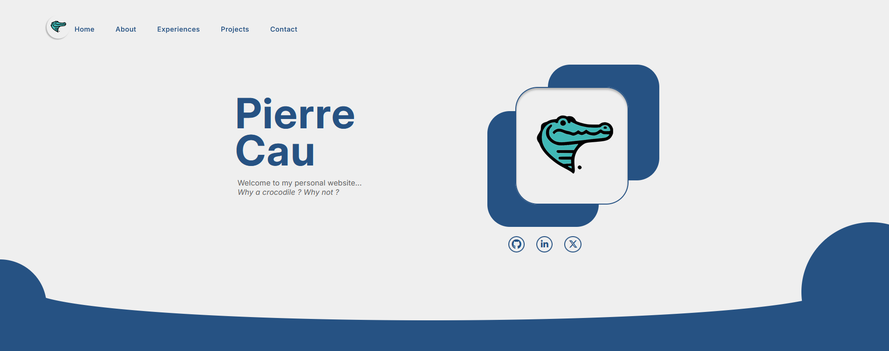

# Mon Portfolio

Bienvenue sur mon portfolio ! Ce projet met en avant mes compétences, projets et expériences professionnelles dans le domaine du développement web.


## Preview 🌟



## 📖 Description

Ce portfolio a été conçu pour vous donner un aperçu de mes compétences techniques, de mes projets, et de mon parcours professionnel. Il contient des exemples concrets de travaux que j'ai réalisés.

### Technologies utilisées :
- `HTML` / `CSS` / `JavaScript`

## ✨ Fonctionnalités

- **Présentation de projets :** Visualisez mes projets avec descriptions et démos en ligne.
- **Expériences professionnelles :** Parcourez mes expériences passées et mon rôle dans différents projets.
- **Formulaire de contact :** Vous pouvez me contacter directement via un formulaire intégré.

## 🚀 Installation

Pour exécuter ce projet localement, suivez ces étapes :

1. Clonez le dépôt :
   ```bash
   git clone https://github.com/pierre-cau/portfolio.git
   ```

2. Ouvrez le dossier du projet :
   ```bash
   cd portfolio
   ```

3. Ouvrez le fichier `index.html` dans votre navigateur web.

## 📝 License

Ce projet est sous licence MIT. Voir le fichier [LICENSE](LICENSE) pour plus d'informations.

---

🚀 **[Voir le site en ligne](https://pierre-cau.github.io/portfolio/)**

👤 **Pierre Cau**

- GitHub : [@pierre-cau](https://github.com/pierre-cau)
- LinkedIn : [Pierre Cau](https://www.linkedin.com/in/pierre-cau/)


